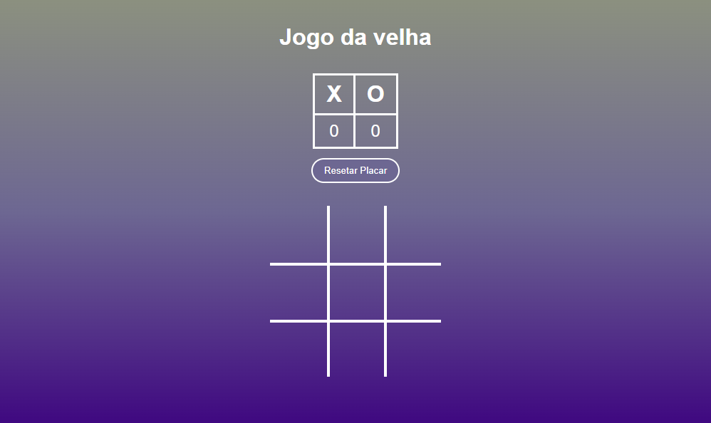

# 🕹️ Jogo da Velha

Projeto de Jogo da Velha desenvolvido com HTML, CSS e JavaScript, publicado no GitHub Pages. Permite que dois jogadores joguem alternadamente com placar acumulativo e botões para resetar o placar.

🔗 Acesse o jogo online: [charlesson-mp.github.io/jogo-da-velha](https://charlesson-mp.github.io/jogo-da-velha/)

## 📸 Demonstração

---

## 🧠 Funcionalidades

- Interface simples e intuitiva.
- Jogo para dois jogadores.
- Placar que contabiliza vitórias.
- Botão para resetar o placar.
- Animações de hover e layout responsivo.

---

## 🚀 Tecnologias utilizadas

- **HTML5**: Estrutura semântica da página.
- **CSS3**: Estilização com variáveis, grid layout e efeitos visuais.
- **JavaScript**: Lógica do jogo, manipulação do DOM e controle de placar.

---

## 📁 Estrutura de diretórios

jogo-da-velha/  
├── index.html # Página principal  
├── src/  
│ ├── css/  
│ │ └── style.css # Estilo da interface  
│ ├── script/  
│ │ └── script.js # Lógica do jogo  
│ └── images/  
│ ├── favicon.ico # Ícone da aba do navegador  
│ └── preview.png # Imagem de demonstração do jogo  
├── LICENSE # Licença do projeto

## 📦 Como acessar

1. Acesse o link: **[https://charlesson-mp.github.io/jogo-da-velha/](https://charlesson-mp.github.io/jogo-da-velha/)**
2. O jogo será carregado automaticamente.
3. Clique nas células para jogar (turnos alternados entre X e O).
4. Utilize o botão para resetar o placar.

---

## 📜 Licença

Distribuído sob a licença incluída no arquivo [LICENSE](./LICENSE).

---

## 🙋‍♂️ Autor

Desenvolvido por [Charlesson Mendes](https://www.linkedin.com/in/charlesson-mendes-developer/).  